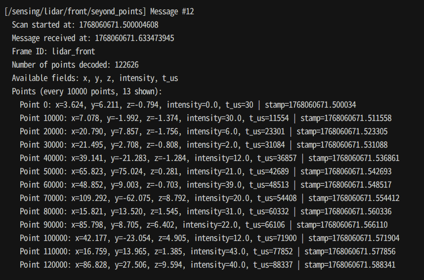

# bag_converter

## Overview

`bag_converter` is a tool for converting rosbag2 files containing Nebula packets or Seyond scan messages to PointCloud2 messages. The tool automatically detects and decodes:

- Nebula packet topics (`/nebula_packets`) and converts them to point cloud topics (`/nebula_points`)
- Seyond scan topics (`/seyond_packets`) and converts them to point cloud topics (`/seyond_points`)

**Supported storage formats:** mcap, sqlite3

## Install

```shell
# clone repository
git clone https://github.com/tier4/bag_converter.git
cd bag_converter

# build
cd docker
./build.sh

# clean build
./build.sh --no-cache
```

### Switching Versions

To use a specific version, checkout the corresponding tag and rebuild:

```shell
# list available versions
git tag

# checkout a specific version and rebuild
git checkout v0.4.0
cd docker
./build.sh
```

## Usage

```shell
./bag_converter <input_bag> <output_bag> [options]
./bag_converter <input_dir> <output_dir> [options]
```

If the input path is a directory, all bag files (`.mcap`, `.db3`, `.sqlite3`) in it are automatically converted. The directory structure is mirrored in the output, and output filenames match the input filenames. All options are applied to every file. If a file fails to convert, the error is logged and processing continues with the remaining files.

### Options

| Option                        | Description                                                                                                                       |
| ----------------------------- | --------------------------------------------------------------------------------------------------------------------------------- |
| `--help`, `-h`                | Show help message                                                                                                                 |
| `--point-type <type>`         | Output point type: `xyzit` (default), `xyzi`, or `en_xyzit` (en_xyzit includes refl_type)                                         |
| `--keep-original`             | Keep original packet topics in output bag                                                                                         |
| `--base-frame <frame>`        | Transform PointCloud2 to the specified TF frame                                                                                   |
| `--tf-mode <static\|dynamic>` | TF mode: `static` (default) or `dynamic`                                                                                          |
| `--min-conf-level <0-3>`      | **[Experimental]** Minimum packet confidence level (default: `0`, no filtering). Only effective for SeyondScan with Falcon LiDAR. |

The `--base-frame` option transforms all output PointCloud2 messages to the specified coordinate frame using TF data (`tf2_msgs/msg/TFMessage`) from the input bag. The `--tf-mode` option controls how TF data is handled:

- **static** (default): Only the first TF message(s) are read. The same fixed transform is applied to all point clouds. Suitable when the sensor mount does not change.
- **dynamic**: All TF messages are pre-loaded. Each point cloud is transformed using the time-dependent TF lookup matching its timestamp. Required when the TF tree changes over time.

In both modes, TF data is pre-loaded from the bag before processing begins, so transforms are always available even if TF messages appear after point cloud messages in the bag. The conversion fails if the specified frame is not found or if any point cloud cannot be transformed.

### Examples

```shell
# Basic conversion
./bag_converter input.mcap output.mcap

# Show help
./bag_converter --help

# Specify output point type (xyzi without timestamp field)
./bag_converter input.mcap output.mcap --point-type xyzi

# Keep original packet topics in output
./bag_converter input.mcap output.mcap --keep-original

# Convert all bag files in a directory (batch mode)
./bag_converter /path/to/input_dir /path/to/output_dir

# Batch mode with options
./bag_converter /path/to/input_dir /path/to/output_dir --point-type xyzi

# Transform point clouds to base_link frame (static TF, default)
./bag_converter input.mcap output.mcap --base-frame base_link

# Transform with dynamic (time-dependent) TF
./bag_converter input.mcap output.mcap --base-frame base_link --tf-mode dynamic

# Filter Seyond packets with low confidence level
./bag_converter input.mcap output.mcap --min-conf-level 2
```

## Message Types

### Input

The tool supports two input message types:

#### NebulaPackets

The input bag file contains `nebula_msgs::msg::NebulaPackets` messages on topics ending with `/nebula_packets`. This format is used when recording with the **Nebula** universal lidar driver (using its Seyond driver for Seyond LiDAR sensors). The messages contain raw packet data.

#### SeyondScan

The input bag file contains `seyond::msg::SeyondScan` messages on topics ending with `/seyond_packets`. This format is used when recording with the **official Seyond SDK**. The messages contain scan data from Seyond LiDAR sensors.

### Output: PointCloud2

The output bag file contains `sensor_msgs::msg::PointCloud2` messages on topics ending with `/nebula_points` (for Nebula input) or `/seyond_points` (for Seyond input). The PointCloud2 messages have the following structure:

#### Fields

**Normal fields** (present for point types xyzit, xyzi, en_xyzit):

- `x` (float32): X coordinate in meters
- `y` (float32): Y coordinate in meters
- `z` (float32): Z coordinate in meters
- `intensity` (float32): Intensity value
- `t_us` (uint32): **[DEPRECATED, will be removed in v0.6.0]** Replaced by `timestamp`. Relative timestamp in microseconds from the scan start time (xyzit, en_xyzit only)
- `timestamp` (uint32): Relative timestamp in nanoseconds from the scan start time (xyzit, en_xyzit only)

**Extended fields** (experimental; subject to change). Supported for **SeyondScan** input only.

- `refl_type` (int8): Point classification (en_xyzit only). **Values:** 0 = normal, 1 = ground, 2 = fog; **-1** = not available.
- `elongation` (int16): Raw elongation value (en_xyzit only). **Values:** 0–15 when available; **-1** = not available.
- `lidar_status` (int8): LiDAR operating status (en_xyzit only). **Values:** 0 = none, 1 = transition, 2 = normal, 3 = failed; **-1** = not available.
- `lidar_mode` (int8): LiDAR operating mode (en_xyzit only). **Values:** 1 = sleep, 2 = standby, 3 = work_normal, 6 = protection; **-1** = not available.

#### Timestamps

All timestamps in PointCloud2 messages are based on UTC (Coordinated Universal Time).

- **`header.stamp`**: Absolute timestamp representing the scan start time in UTC. This timestamp is generated by the LiDAR and represents when the scan began.
- **`t_us` field**: **[DEPRECATED, will be removed in v0.6.0]** Replaced by `timestamp`. Relative timestamp in microseconds from the scan start time (`header.stamp`)
- **`timestamp` field**: Relative timestamp in nanoseconds from the scan start time (`header.stamp`)

The absolute timestamp for each point (in nanoseconds, UTC) can be calculated as:

```text
absolute_timestamp_ns = (header.stamp.sec * 1,000,000,000 + header.stamp.nanosec) + timestamp
```

Or, using the deprecated `t_us` field:

```text
absolute_timestamp_ns = (header.stamp.sec * 1,000,000,000 + header.stamp.nanosec) + (t_us * 1,000)
```

## Parsing PointCloud2 Messages

The repository includes a Python script `scripts/decode_pointcloud2.py` that demonstrates how to parse PointCloud2 messages from rosbag2 files.

### Basic Usage

```shell
# Decode all PointCloud2 topics in a bag file
python scripts/decode_pointcloud2.py <path-to-bag>

# Decode a specific topic
python scripts/decode_pointcloud2.py <path-to-bag> --topic /sensing/lidar/front/nebula_points

# Show every 500th point per scan (default: 10000)
python scripts/decode_pointcloud2.py <path-to-bag> --point-step 500

# Add delay between messages (in seconds)
python scripts/decode_pointcloud2.py <path-to-bag> --delay 0.1
```

### Example Output

The following image shows example output from `decode_pointcloud2.py`:



**Note:** The "Available fields" shown in the output are the fields embedded in the PointCloud2 message. The "stamp" value displayed for each point is calculated from `header.stamp` and `t_us` field, representing the absolute timestamp of that point.
